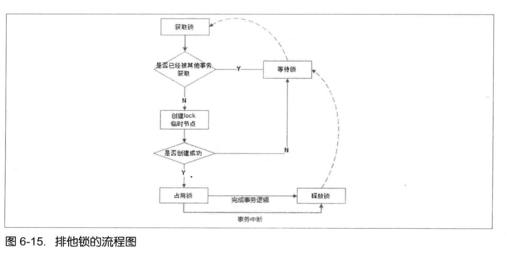
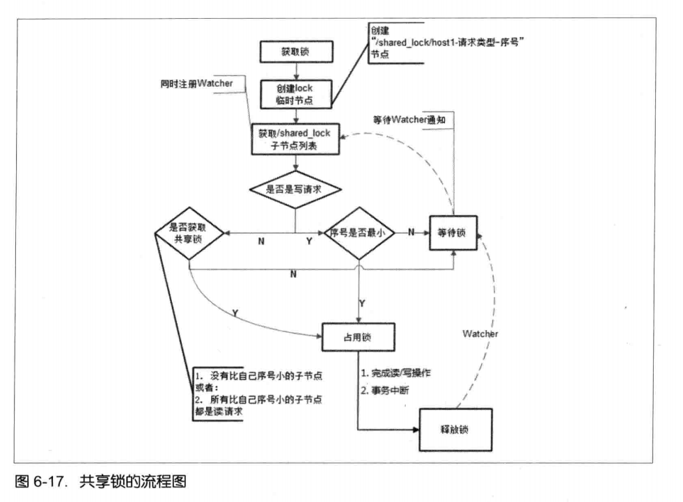

#Zookeeper常见的一些应用场景
##1.数据发布/订阅（配置管理）
　　数据发布/订阅系统，即配置中心。通过将数据发布到zk的一个或一系列节点上，供订阅者进行数据订阅，进而达到动态获取数据的目的，实现配置信息的集中式管理和数据的动态更新。  

　　ZK实现方法时，客户端向服务端注册自己需要关注的节点，一旦该节点的数据发生变更，那么服务端就会向相应的客户端发送Watcher事件通知，客户端接收到这个消息通知之后，需要主动到服务端获取最新的数据。配置中心的三个特点：  

  * 数据了通常比较小  
  * 数据内容在运行时会发生动态变化  
  * 集群中各机器共享，配置一致  
  
###1.1 使用ZK实现配置中心
TODO 要不要放代码？
####1.1.1 
###1.2 使用ZK做配置中心的一些缺点
MCC 2.0实现

##2.软负载均衡
　　分布式系统中常见的一种技术，为了保证系统的高可用性，通常采用副本的方式来对服务进行部署，而对于服务消费者而言，只需要在这些服务提供方中选择一个来执行相关的业务逻辑。
###2.1 appenv和跳板机
　　mt开发环境的appenv配置项和登陆跳板机后，ssh到对应机器，是否是存储了机器别名和ip之间的映射关系
###2.2 服务消费者到服务提供者的软负载均衡
TODO 客户端通过zk拉取服务器列表

##3.命名服务
　　命名服务也是分布式系统中比较常见的场景，命名服务就是提供名称的服务，Zookeeper的命名服务有两个应用方面。

* 利用Zookeeper的分层结构，可以把系统中的各种服务的名称、地址、以及目录信息存放在Zookeeper中，需要的时候去Zookeeper中读取。

* 利用Zookeeper循序节点的特性，制作分布式的序列号生成器，或者叫id生成器。 分布式环境下生产全局唯一id，另外一种是UUID（过长，无规律），Zookeeper可以生成有顺序的容易理解的同时支持分布式环境的编号。

###GUID全局唯一ID生成器

    public String generate(String node) {
        String path = rootPath + node + "-";
        try {
            //创建持久的顺序节点
            path = curator.create().creatingParentsIfNeeded().withMode(CreateMode.PERSISTENT_SEQUENTIAL)
                    .forPath(path);
            String result = retrieveGUID(path, node);
            //删除掉该持久节点
            if (fastMode) {
                final String finalPath = path;
                new Thread(() -> {
                    try {
                        curator.delete().forPath(finalPath);
                    } catch (Exception e) {
                        LOGGER.error("delete guid persistent sequential node failed, {}", e);
                    }
                }).start();
            } else {
                curator.delete().forPath(path);
            }
            return result;
        } catch (Exception e) {
            LOGGER.error("generate guid failed, {}", e);
            throw new IllegalStateException("generate guid failed", e);
        }
    }

    //新节点path的最后一段即是生产的全局唯一顺序自增的id
    private String retrieveGUID(String path, String node) {
        return path.substring(path.lastIndexOf(node) + node.length() + 1);
    }
##4.分布式锁
###4.1 排他锁

###4.2 共享锁
TODO 放一张共享锁的截图

###4.3 羊群效应以及改进后的共享锁
　　在一个客户端移除自己的共享锁后，会发生以下两件事：  
　　1. Zookeeper会发送锁节点的子节点变更WatcheEvent通知给所有要获取锁客户端（产生大量的watcher通知）  
　　2. 所有要获取锁的客户端，判断自己在锁的子节点列表的位置，来占用锁或者继续等待锁（大量拉取子节点列表）
  
　　客户端监听过多和自己不相关的事件通知，在集群规模较大时，会对Zookeeper服务造成严重的性能影响和网络冲击。并且如果同一时间有多个节点对应的客户端完成事务或者事务中断引起节点消失，Zookeeper服务器就会在短时间内向其余客户端发送大量的事件通知，就是所谓的羊群效应。  
　　  
　　改进方法：每个节点对应的客户端只需要监听比自己序号小的节点即可

　　步骤：  
　　1. 客户端在锁节点下创建临时写/读顺序节点  
　　2. 客户端拉取锁节点下的子节点列表，但是不对锁节点的注册watcher  
　　3. 如果客户端无法获取锁，就对比自己小的节点注册watcher。比自己小的节点，对于读和写请求，和获取锁的条件类似。  
　　　读节点：向比自己序号小的最后一个写请求节点注册watcher  
　　　写请求：向比自己序号小的最后一个节点注册watcher  
　　4.等待watcher通知，重复步骤2，直到获取锁